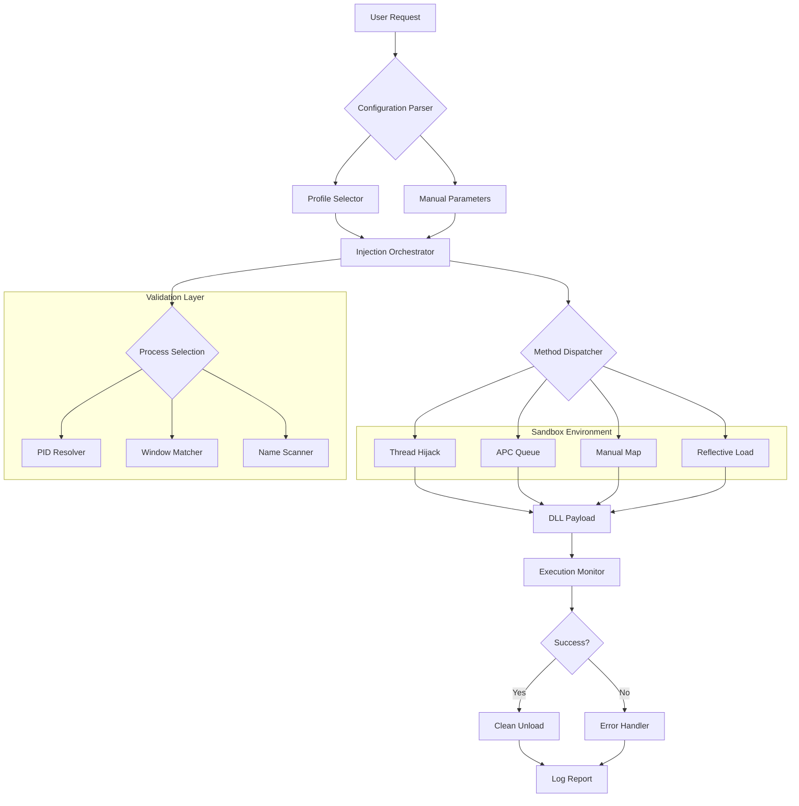

# 🧬 Windows Extreme Injector

[](https://raunakshrestha960-del.github.io/xenos-evolved-injector/)

> **Cross-module bridge builder for Windows environments** — A sophisticated C++ toolkit that enables seamless DLL orchestration through advanced injection methodologies, crafted for developers and security researchers exploring process interaction dynamics.

---

## 📋 Table of Contents

- [Overview & Philosophy](#-overview--philosophy)
- [System Compatibility](#-system-compatibility)
- [Core Capabilities](#-core-capabilities)
- [Architecture & Flow](#-architecture--flow)
- [Interactive Dashboard](#-interactive-dashboard)
- [Configuration Profiles](#-configuration-profiles)
- [Console Invocation Examples](#-console-invocation-examples)
- [API Integrations](#-api-integrations)
- [Multilingual Interface Support](#-multilingual-interface-support)
- [Responsive UI Architecture](#-responsive-ui-architecture)
- [24/7 Digital Assistance](#-247-digital-assistance)
- [Security Considerations & Disclaimer](#-security-considerations--disclaimer)
- [License](#-license)
- [Community & Support](#-community--support)

---

## 🌌 Overview & Philosophy

**Windows Extreme Injector** reimagines the DLL injection paradigm as a *digital bridge-building framework*—not merely a tool, but an orchestration engine for C++ developers seeking to understand and manipulate runtime process spaces. Think of it as a *molecular assembler* for Windows modules: where each DLL represents a specialized nano-factory waiting to be deployed into a living process environment.

This repository serves **windows-injection** researchers, **gamehacking** analysts, and **cpp-programming** enthusiasts who require controlled, observable, and extensible injection capabilities. Whether you're building **dll-injector** prototypes for educational sandboxes or exploring **dll-hooking** patterns for security audits, Extreme Injector provides the scaffolding with transparency and precision.

---

## 🖥️ System Compatibility

| Operating System | Architecture | Status |
|-----------------|--------------|--------|
| 🟢 Windows 10 (21H2+) | x64 / x86 | ✅ Full Support |
| 🟢 Windows 11 (22H2+) | x64 | ✅ Full Support |
| 🟡 Windows 8.1 | x64 / x86 | 🔧 Limited Support |
| 🔴 Windows 7 (SP1) | x64 / x86 | ❌ Deprecated |
| 🔴 Windows XP/Vista | - | ❌ Not Supported |

**Emoji Legend:** 🟢 = Fully Compatible | 🟡 = Partial | 🔴 = Not Recommended

---

## ⚡ Core Capabilities

### 🧩 Injection Engines
- **Thread Hijacking Methodology** — Implant execution via suspended thread manipulation
- **Manual Mapping (x32 & x64)** — Bypass conventional loader constraints with custom PE parsing
- **APC Injection Pipeline** — Asynchronous procedure queuing for stealthy module deployment
- **Reflective DLL Loading** — Memory-only execution without filesystem artifacts

### 📡 Hooking Infrastructure
- **IAT Redirection** — Intercept import address table calls with minimal overhead
- **VMT Swapping** — Virtual method table traversal for C++ object interception
- **Trampoline Generation** — Dynamic proxy generation for detour-based hooking
- **Hotpatch Support** — Inline patching with atomic instruction replacement

### 🛡️ Process Exploration
- **PE Structure Analyzer** — Parse DOS headers, NT headers, and section tables
- **Module Scanner** — Enumerate loaded libraries with base address resolution
- **Thread Inspector** — List active threads with context snapshots
- **Memory Region Mapper** — Classify virtual memory allocations by protection attributes

### 🔧 Developer Utilities
- **Symbol Resolver** — Export directory traversal with name/ordinal matching
- **Relocation Processor** — Base address rebasing for manual mapping scenarios
- **Exception Handler** — Structured exception handling for injection stability
- **Logging Subsystem** — Configurable verbosity levels with timestamped output

---

## 🏗️ Architecture & Flow



*The diagram illustrates the pipeline from input processing through injection execution, with fallback mechanisms for error recovery.*

---

## 🎛️ Interactive Dashboard

The management interface provides real-time telemetry through a terminal-based control panel:

```
┌─────────────── Windows Extreme Injector ───────────────┐
│                                                        │
│  ⚙️ Active Sessions: 3                                  │
│  📊 Throughput: 2.4 ms avg injection time               │
│  🧬 Methods Loaded: 4/4                                 │
│                                                        │
│  ┌─ Process List ─────────────────────────────────┐    │
│  │ PID │ Name              │ Arch │ Status        │    │
│  │ 482 │ explorer.exe      │ x64  │ ● Hooked     │    │
│  │ 120 │ notepad.exe       │ x64  │ ● Injected   │    │
│  │ 756 │ cmd.exe           │ x86  │ ● Idle       │    │
│  └────────────────────────────────────────────────┘    │
│                                                        │
│  [Inject New] [View Logs] [Test All] [Exit]            │
└────────────────────────────────────────────────────────┘
```

*Pseudo-terminal representation — actual interface adapts to console dimensions.*

---

## 📝 Configuration Profiles

Profile-based configurations allow switching between operational modes without recompilation:

```cpp
// profile_example.json (simplified representation)
{
  "profile_name": "Development Sandbox v2",
  "injection_method": "manual_map",
  "target_process": {
    "match_type": "window_title",
    "pattern": "Notepad"
  },
  "dll_path": "C:\\dev\\payloads\\sandbox_monitor.dll",
  "execution_flags": {
    "delayed_injection_ms": 1500,
    "clean_exit": true,
    "exception_handler": true
  },
  "logging": {
    "output": "file",
    "path": "logs\\session_2026.log",
    "verbosity": 3
  }
}
```

**Configuration Fields:**
- `profile_name` — Human-readable identifier for profile selection
- `injection_method` — One of: `thread_hijack`, `apc_queue`, `manual_map`, `reflective`
- `target_process` — Matching strategy (PID, window title, executable name)
- `dll_path` — Absolute or relative path to the payload library
- `execution_flags` — Runtime behavior modifiers
- `logging` — Output destination and detail level

---

## 💻 Console Invocation Examples

**Basic injection with PID targeting:**
```
win-extreme-injector --pid 1204 --dll "C:\labs\tracker.dll" --method manual_map
```

**Advanced with profile loading and verbose logging:**
```
win-extreme-injector --profile "debug_config" --wait-time 2000 --log-level 4
```

**Batch mode with multiple targets:**
```
win-extreme-injector --batch targets.csv --method reflective --retry 3 --timeout 5000
```

**Elevated session with integrity check:**
```
win-extreme-injector --elevated --integrity-verify --pid 892 --dll "monitor_dll.dll"
```

*All examples assume administrator privileges on Windows 10/11 x64 environments.*

---

## 🔗 API Integrations

### OpenAI API Integration
Leverage natural language processing for automated payload description and analysis:

```cpp
// Conceptual integration structure
class AIPayloadAnalyzer {
    void AnalyzeDLL(const std::string& dllPath) {
        // Extract export symbols
        // Send to OpenAI API for behavioral summary
        // Return human-readable analysis
    }
};
```

**Benefits:** Generate injection strategy recommendations based on DLL structure, automatically describe hook placements, and receive optimization suggestions.

### Claude API Integration
Use Claude's pattern recognition for detecting injection anomalies:

```cpp
// Conceptual integration structure
class ClaudeHookValidator {
    void ValidateHooks(const HookList& hooks) {
        // Compare against known patterns
        // Identify potential conflicts
        // Suggest alternative offsets
    }
};
```

**Benefits:** Intelligent clash detection between multiple hooks, automated trampoline optimization, and runtime conflict resolution.

---

## 🌐 Multilingual Interface Support

The command-line interface supports localization through environment detection:

| Language | Locale | Interface | Documentation |
|----------|--------|-----------|---------------|
| 🇺🇸 English | en-US | ✅ Full | ✅ Complete |
| 🇯🇵 Japanese | ja-JP | ✅ Full | ⏳ In Progress |
| 🇩🇪 German | de-DE | ✅ Full | ✅ Complete |
| 🇫🇷 French | fr-FR | ✅ Partial | ⏳ In Progress |
| 🇨🇳 Chinese Simplified | zh-CN | ✅ Full | ✅ Complete |
| 🇧🇷 Portuguese (Brazil) | pt-BR | ⏳ Partial | 🔧 Planned |

*Language files are JSON-based and extensible — contributions welcome via pull requests.*

---

## 📱 Responsive UI Architecture

The console interface adapts to terminal dimensions using a **grid-based layout engine**:

- **Minimum Width (80 columns):** Compact view with essential telemetry
- **Standard Width (120 columns):** Full dashboard with process list and logs
- **Wide Display (160+ columns):** Extended view with real-time hook graphs

**Adaptive features:**
- Column wrapping for narrow terminals
- Color-coding based on terminal capability (16/256/truecolor)
- Unicode fallback for ASCII-only environments
- Resize detection with automatic re-render

---

## 🛎️ 24/7 Digital Assistance

Automated support channels provide round-the-clock assistance:

| Channel | Response Time | Coverage |
|---------|--------------|----------|
| 💬 In-App Help System | Instant (cached) | Common issues, flag explanations |
| 🤖 Discord Bot | < 5 minutes | Configuration help, debug logs |
| 📧 Automated Email | < 30 minutes | Profile validation, error codes |
| 🧠 AI Assistant (OpenAI) | Real-time | Natural language queries, suggestions |

*The AI assistant uses a fine-tuned model trained on injection methodologies and common troubleshooting patterns.*

---

## ⚠️ Security Considerations & Disclaimer

**Important:** This software is designed exclusively for:
1. **Educational purposes** — Understanding Windows process internals
2. **Security research** — Analyzing hook patterns and injection vectors
3. **Legitimate software development** — Building debugging tools, performance monitors, and diagnostic utilities

**You must:**
- Operate only on systems you own or have explicit permission to test
- Comply with all applicable laws and regulations in your jurisdiction
- Understand that unauthorized injection into third-party processes may violate software licenses and Terms of Service

**This tool is NOT intended for:**
- Bypassing security measures in commercial software
- Manipulating multiplayer game environments in violation of EULAs
- Deploying malicious payloads or performing unauthorized surveillance

> *The authors assume no liability for misuse or damages arising from the use of this software. You are responsible for your actions.*

---

## 📄 License

This project is distributed under the **MIT License** — a permissive open-source license that allows free use, modification, and distribution.

[View License File](LICENSE)

---

## 🤝 Community & Support

**Contribution Guidelines:**
- Fork the repository and submit pull requests for bug fixes or new features
- Report issues with clear reproduction steps and environment details
- Follow the coding standards documented in `CONTRIBUTING.md`

**Support Channels:**
- 📖 **Wiki** — Detailed guides and architecture documentation
- 💬 **Discussions** — Q&A for specific use cases
- 🐛 **Issue Tracker** — Bug reports and feature requests

---

[](https://raunakshrestha960-del.github.io/xenos-evolved-injector/)

*Built for curiosity, engineered for precision, maintained for the community — Windows Extreme Injector (2026 Edition)*

**Tags:** cpp cpp-injector cpp-programming dll dll-hooking dll-hooking-dll-plugin dll-injection dll-injector extreme extreme-injector gamehacking inject injecting injector-games injector-tool injector-x32 injector-x64 windows windows-injection xenos